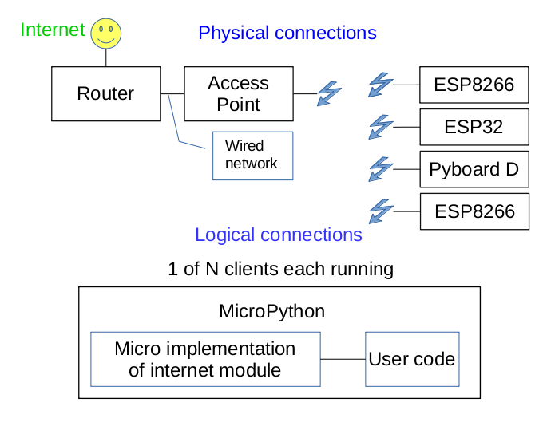
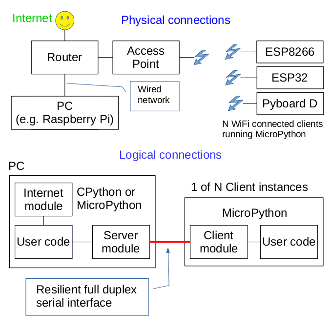

# NOTE: Under development!

The server-side API has changed: in particular the `run` coro args. See
[section 10](./README.md#10-planned-enhancements) for forthcoming changes.

# 0. MicroPython IOT application design

IOT (Internet of Things) systems commonly comprise a set of endpoints on a WiFi
network. Internet access is provided by an access point (AP) linked to a
router. Endpoints run an internet protocol such as MQTT or HTTP and normally
run continuously. They may be located in places which are hard to access:
reliability is therefore paramount. Security is also a factor for endpoints
exposed to the internet.

Under MicroPython the available hardware for endpoints is limited. At the time
of writing (December 2018) the Pyboard D is not yet available. The ESP32 is
incapable of 24/7 operation owing to [this issue](https://github.com/micropython/micropython-esp32/issues/167).
The ESP8266 remains as a readily available inexpensive device which, with care,
is capable of long term reliable operation. It does suffer from limited
resources, in particular RAM. Achieving resilient operation in the face of WiFi
or server outages is not straightforward: see
[this document](https://github.com/peterhinch/micropython-samples/tree/master/resilient).
The approach advocated here simplifies writing resilient ESP8266 IOT
applications by providing a communications channel with inherent resilience.

The usual arrangement for MicroPython internet access is as below.


Running internet protocols on ESP8266 nodes has the following drawbacks:
 1. It can be difficult to ensure resilience in the face of outages of WiFi and
 of the remote endpoint.
 2. Running TLS on the ESP8266 is demanding in terms of resources: establishing
 a connection can take 30s.
 3. There are potential security issues for internet-facing nodes.
 4. The security issue creates a requirement periodically to install patches to
 firmware or to libraries. This raises the issue of physical access.
 5. Internet applications can be demanding of RAM.

This document proposes an alternative where the ESP8266 nodes communicate with
a local server. This runs CPython or MicroPython code and supports the internet
protocol required by the application. The server and the ESP8266 nodes
communicate using a simple protocol based on the exchange of lines of text. The
server can run on a Linux box such as a Raspberry Pi; this can run 24/7 at
minimal running cost.

  

Benefits are:
 1. Security is handled on a device with an OS. Updates are easily accomplished.
 2. The text-based protocol minimises the attack surface presented by nodes.
 3. The protocol is resilient in the face of outages of WiFi and of the server:
 barring errors in the application design, crash-free 24/7 operation is a
 realistic prospect.
 4. The amount of code running on the ESP8266 is smaller than that required to
 run a resilient internet protocol such as [this MQTT version](https://github.com/peterhinch/micropython-mqtt.git).
 5. The server side application runs on a relatively powerful machine. Even
 minimal hardware such as a Raspberry Pi has the horsepower easily to support
 TLS and to maintain concurrent links to  multiple client nodes. Use of
 threading is feasible.
 6. The option to use CPython on the server side enables access to the full
 suite of Python libraries including internet modules.

The principal drawback is that in addition to application code on the ESP8266
node, application code is also required on the PC to provide the "glue" linking
the internet protocol with each of the client nodes. In many applications this
code may be minimal.

There are use-cases where conectivity is entirely local, for example logging
locally acquired data or using some nodes to control and monitor others. In
such cases no internet protocol is required and the server side application
merely passes data between nodes and/or logs data to disk.

This architecture can be extended to non-networked clients such as the Pyboard.
This is forthcoming and is described and diagrammed
[here](./README.md#9-extension-to-the-pyboard).

# 1. Contents

This repo comprises code for resilent full-duplex connections between a server
application and multiple ESP8266 clients. Each connection is like a simplified
socket, but one which persists through outages.

 0. [MicroPython IOT application design](./README.md#0-microPython-iot-application-design)  
 1. [Contents](./README.md#1-contents)  
 2. [Design](./README.md#2-design)  
  2.1 [Protocol](./README.md#21-protocol)  
 3. [Files](./README.md#3-files)  
  3.1 [Installation](./README.md#31-installation)  
  3.2 [Usage](./README.md#32-usage)
 4. [Client side applications](./README.md#4-client-side-applications)  
  4.1 [The Client class](./README.md#41-the-client-class)  
 5. [Server side applications](./README.md#5-server-side-applications)  
  5.1 [The server module](./README.md#51-the-server-module)  
 6. [Ensuring resilience](./README.md#6-ensuring-resilience) Guidelines for application design.   
 7. [Quality of service](./README.md#7-quality-of-service) Guaranteeing message delivery.  
 8. [Performance](./README.md#8-performance)  
  8.1 [Latency and throughput](./README.md#81-latency-and-throughput)  
  8.2 [Client RAM utilisation](./README.md#82-client-ram-utilisation)  
 9. [Extension to the Pyboard](./README.md#9-extension-to-the-pyboard)  
 10. [Planned enhancements](./README.md#10-planned-enhancements)  

# 2. Design

The code is asynchronous and based on `asyncio`. Client applications on the
ESP8266 import `client.py` which provides the interface to the link. The server
side application uses `server_cp.py`.

Messages are required to be complete lines of text. They typically comprise an
arbitrary Python object encoded using JSON and terminated with a newline.

There is no guarantee of delivery of a message. Techniques to overcome this are
described in [section 7](./README.md#7-quality-of-service). Performance
limitations are discussed in [section 8](./README.md#8-performance).

## 2.1 Protocol

Client and server applications use `readline` and `write` methods to
communicate: in the case of an outage of WiFi or the connected endpoint, the
method will pause until the outage ends.

The link status is determined by periodic exchanges of keepalive messages. This
is transparent to the application. If a keepalive is not received within a user
specified timeout an outage is declared. On the client the WiFi is disconnected
and a reconnection procedure is initiated. On the server the connection is
closed and it awaits a new connection.

Each client has a unique ID which is stored in `local.py`. This ID enables the
server application to determine which physical client is associated with an
incoming connection.

###### [Contents](./README.md#1-contents)

# 3. Files

1. `client.py` Client module for ESP8266.
2. `primitives.py` Stripped down version of `asyn.py`.
3. `server_cp.py` Server module. (runs under CPython 3.5+ or MicroPython 1.9.4+)
4. `examples` Package of a general example for client and server usage
    4.1. `c_app.py` Demo client-side application.
    4.2. `s_app_cp.py` Demo server-side application.
    4.3. `local.py` Example of local config file.
5. `examples_remote_control` Package of a specific example of using the library to remote control another esp8266, see [README](./example_remote_control/README.md)
6. `qos` Package of an example qos implementation, see [README](./qos/README.md)

`local.py` should be edited to ensure each client has a unique ID. Other
constants must be common to all clients and the server:
 1. `PORT` Port for socket communication.
 2. `SERVER` IP address of local server PC.
 3. `TIMEOUT` In ms. Normally 1500. See sections 6 and 7.
 4. `CLIENT_ID` Associates an ESP8266 with its server-side application. Must be
 unique to each client. May be any `\n` terminated Python string.
 The client and server configuration is done using constructor arguments, 
 therefore `local.py` is imported in the example files and can be implemented differently. 

## 3.1 Installation

It is recommended to use the latest release build of firmware as such builds
incorporate `uasyncio` as frozen bytecode. Daily builds do not. With a release
build copy the above client files to the device. Edit `local.py` for each example
as described below and copy it to the device. Ensure the device has a stored 
WiFi connection and run the demo.
To run the demo the file `local.py` for the corresponding example should be edited 
for the server IP address.
The demo supports up to four clients. Each client's `local.py` should be edited
to give each client a unique client ID in range 1..4. Note that the ESP8266
must have a stored network connection to access the server.

On the server ensure that `local.py` is on the path and run `s_app_cp.py`.

Alternatively to maximise free RAM, firmware can be built from source, freezing
`uasyncio`, `client.py` and `primitives.py` as bytecode.

If a daily build is used it will be necessary to
[cross compile](https://github.com/micropython/micropython/tree/master/mpy-cross)
`client.py`

To get the files onto your ESP8266 do NOT copy single files as this repository is
built to be used as a python package. This means that you have to retain the file
structure for it to work.
The easiest way is to clone the repository:
```
git clone https://github.com/peterhinch/micropython-iot micropython_iot
```
It's important to clone it into a directory *micropyhton_iot* as python does not like
packages that have a "-" character in their name. 
Then you need [rshell](https://github.com/dhylands/rshell) and follow these commands:
```
rshell -p /dev/ttyS3  # adapt the port to your situation
mkdir /pyboard/micropython_iot   # create directory on your esp822 
(yes you need to use /pyboard here, at least I do)
rsync micropython_iot /pyboard/micropython_iot -v -m
(this can take a while, you might have to do it again if it fails early during the image
transfer of "block_diagram_orig.odg". There's no exclude option for rsync yet)
```
Now you have successfully synchronized the repository onto your device.

The other way is to freeze it into the firmware by copying the repository to the
micropython/ports/esp8266 directory.

## 3.2 Usage

On the esp8266 you can now run every example using the following syntax:
```
from micropython_iot.examples import c_app
from micropython_iot.example_remote_control import c_comms_tx
from micropython_iot.example_remote_control import c_comms_rx
from micropython_iot.qos import c_qos
```


The server part can be used like this when the current directory contains micropython_iot:
```
python3 -m micropython_iot.examples.s_app_cp
python3 -m micropython_iot.example_remote_control.s_comms_cp
python3 -m micropython_iot.qos.s_qos_cp
```

#### Troubleshooting the demo

Startup behaviour:
 1. Client repeatedly detects failure and re-initialises WiFi. Check server is
 running; also that IP address and port in client's `local.py` are correct.
 2. Client spews text. Check ESP8266 has a working WiFi configuration.

#### Further demos

The directories [qos](./qos/README.md) and [example_remote_control](./example_remote_control/README.md) contain
further demos.

###### [Contents](./README.md#1-contents)

# 4. Client side applications

A client-side application instantiates a `Client` and launches a coroutine
which awaits it. After the pause the `Client` has connected to the server and
communication can begin. This is done using `Client.write` and
`Client.readline` methods.

Every client ha a unique ID (`MY_ID`) stored in `local.py`. The ID comprises a
newline-terminated string.

Messages comprise a single line of text; if the line is not terminated with a
newline ('\n') the client library will append it. Newlines are only allowed as
the last character. Blank lines will be ignored.

A basic client-side application has this form:
```python
import uasyncio as asyncio
import ujson
from micropython_iot import client
import local  # or however you configure your project


class App:
    def __init__(self, loop, my_id, server, port, timeout):
        self.cl = client.Client(loop, my_id, server, port, timeout, self.state, None)
        loop.create_task(self.start(loop))

    async def start(self, loop):
        await self.cl  # Wait until client has connected to server
        loop.create_task(self.reader())
        loop.create_task(self.writer())
        
    def state(self, state):
        print("Connection state:", state)

    async def reader(self):
        while True:
            line = await self.cl.readline()  # Wait until data received
            data = ujson.loads(line)
            print('Got', data, 'from server app')

    async def writer(self):
        data = [0, 0]
        count = 0
        while True:
            data[0] = count
            count += 1
            print('Sent', data, 'to server app\n')
            await self.cl.write(ujson.dumps(data))
            await asyncio.sleep(5)
        
    def close(self):
        self.cl.close()

loop = asyncio.get_event_loop()
app = App(loop, local.MY_ID, local.SERVER, local.PORT, local.TIMEOUT, True)
try:
    loop.run_forever()
finally:
    app.close()  # Ensure proper shutdown e.g. on ctrl-C
```
If an outage of server or WiFi occurs, the `write` and `readline` methods will
pause until connectivity has been restored. The server side API is similar.

## 4.1 The Client class

Constructor args:
 1. `loop` The event loop.
 2. `my_id` The client id.
 3. `server` The server IP-Adress to connect to.
 4. `port` The port the server listens on.
 5. `timeout` The timeout for connection, used for connection state detection.
 6. `connected_cb` Callback or coroutine that is called whenever the connection changes
 7. `connected_cb_args` Arguments that will be passed to the *connected_cb* callback. First argument however is always the state.
 8. `verbose=False` Provides optional debug output.
 9. `led=None` If a `Pin` instance is passed it will be toggled each time a
 keepalive message is received. Can provide a heartbeat LED if connectivity is
 present.

Methods (asynchrounous):
 1. `readline` No args. Pauses until data received. Returns a line.
 2. `write` Args: `buf`, `pause=True`. `buf` holds a line of text. If `pause`
 is set the method will pause after writing to ensure that the total elapsed
 time exceeds the timeout period. This minimises the risk of buffer overruns in
 the event that an outage occurs.

Methods (synchronous):
 1. `status` Returns `True` if connectivity is present.
 2. `close` Closes the socket. Should be called in the event of an exception
 such as a ctrl-c interrupt.

Bound variable:
 1. `connects` The number of times the `Client` instance has connected to WiFi.

The `Client` class is awaitable. If
```python
await client_instance
```
is issued, the coroutine will pause until connectivity is (re)established.

The client only buffers a single incoming message. To avoid message loss ensure
that there is a coroutine which spends most of its time awaiting incoming data.

###### [Contents](./README.md#1-contents)

# 5. Server side applications

A typical example has an `App` class with one instance per physical client
device. This enables instances to share data via class variables. Each instance
launches a coroutine which acquires a `Connection` instance for its individual
client (specified by its client_id). This process will pause until the client
has connected with the server. Communication is then done using the `readline`
and `write` methods of the `Connection` instance.

Messages comprise a single line of text; if the line is not terminated with a
newline ('\n') the server library will append it. Newlines are only allowed as
the last character. Blank lines will be ignored.

A basic server-side application has this form:
```python
import asyncio
import json
from micropython_iot import server_cp as server
import local  # or however you want to configure your project

class App:
    def __init__(self, loop, client_id):
        self.client_id = client_id  # This instance talks to this client
        self.conn = None  # Will be Connection instance
        self.data = [0, 0, 0]  # Exchange a 3-list with remote
        loop.create_task(self.start(loop))

    async def start(self, loop):
        # await connection from the specific EP8266 client
        self.conn = await server.client_conn(self.client_id)
        loop.create_task(self.reader())
        loop.create_task(self.writer())

    async def reader(self):
        while True:
            # Next line will pause for client to send a message. In event of an
            # outage it will pause for its duration.
            line = await self.conn.readline()
            self.data = json.loads(line)
            print('Got', self.data, 'from remote', self.client_id)

    async def writer(self):
        count = 0
        while True:
            self.data[0] = count
            count += 1
            print('Sent', self.data, 'to remote', self.client_id, '\n')
            await self.conn.write(json.dumps(self.data))  # May pause in event of outage
            await asyncio.sleep(5)
        

def run():
    loop = asyncio.get_event_loop()
    clients = {1, 2, 3, 4}
    apps = [App(loop, n) for n in clients]  # Accept 4 clients with ID's 1-4
    try:
        loop.run_until_complete(server.run(loop, clients, False, local.PORT, local.TIMEOUT))
    except KeyboardInterrupt:
        print('Interrupted')
    finally:
        server.Connection.close_all()

if __name__ == "__main__":
    run()
```

## 5.1 The server module

This is based on the `Connection` class. A `Connection` instance provides a
communication channel to a specific ESP8266 client. The `Connection` instance
for a given client is a singleton and is acquired by issuing
```python
conn = await server.client_conn(client_id)
```
This will pause until connectivity has been established. It can be issued at
any time: if the `Connection` has already been instantiated, that instance will
be returned. The `Connection` constructor should not be called by applications.

The `Connection` instance:

Methods (asynchrounous):
 1. `readline` No args. Pauses until data received. Returns a line.
 2. `write` Args: `buf`, `pause=True`. `buf` holds a line of text. If `pause`
 is set the method will pause after writing to ensure that the total elapsed
 time exceeds the timeout period. This minimises the risk of buffer overruns in
 the event that an outage occurs.

Method (synchronous):
 1. `status` Returns `True` if connectivity is present.

Class Method (synchronous):
 1. `close_all` No args. Closes all sockets: call on exception (e.g. ctrl-c).

The `Connection` class is awaitable. If
```python
await connection_instance
```
is isuued, the coroutine will pause until connectivity is (re)established.

The server buffers incoming messages but it is good practice to have a coro
which spends most of its time waiting for incoming data.

Server module coroutines:

 1. `run` Args: `loop` `expected` `verbose=False` `port=8123` `timeout=1500`
 This is the main coro and starts the system. 
 `loop` is the event loop. `expected` is a set containing the ID's of all clients. 
 `verbose` causes debug messages to be printed. `port` is the port to listen to
  and `timeout` is the amount of ms that can pass without a keepalive until the 
  connection is considered dead.
 2. `client_conn` Arg: `client_id`. Returns the `Connection` instance for the
 specified client when that client first connects.
 3. `wait_all` Arg: `client_id=None` Behaves as `client_conn` except that it
 pauses until all expected clients have connected. If `None` is passed, the
 assumption is that the current client is already connected. Pauses until all
 other clients are also ready.

###### [Contents](./README.md#1-contents)

# 6. Ensuring resilience

There are two principal ways of provoking `LmacRxBlk` errors and crashes.
 1. Failing to close sockets when connectivity is lost.
 2. Feeding excessive amounts of data to a socket after connectivity is lost:
 this causes an overflow to an internal ESP8266 buffer.

These modules aim to address these issues transparently to application code,
however it is possible to write applications which vioate 2.

There is a global `TIMEOUT` value defined in `local.py` which should be the
same for the server and all clients. Each end of the link sends a `keepalive`
(KA) packet (an empty line) at a rate guaranteed to ensure that at least one KA
will be received in every `TIMEOUT` period. If it is not, connectivity is
presumed lost and both ends of the interface adopt a recovery procedure.

By default the `write` methods implement a pause which ensures that only one
packet can be sent during the `TIMEOUT` interval. This aims to ensure that
condition 2. above is met. However if more than one message is sent in quick
succesion, only the first will have low latency.

Calling `write` with `pause=False` fixes this but requires that the application
limits the amount of data transmitted in the `TIMEOUT` period to avoid buffer
overflow.

###### [Contents](./README.md#1-contents)

# 7. Quality of service

In MQTT parlance the link operates at qos==0: there is no guarantee of packet
delivery. Normally when an outage occurs transmission is delayed until
connectivity resumes. Packet loss will occur if, at the time when a message is
sent, an outage has occurred but has not yet been detected by the sender.

In practice it is easy to achieve qos==2 in application code; in this case
message delivery is guaranteed and messages will be processed once only. This
is dicussed [here](./qos/README.md).

###### [Contents](./README.md#1-contents)

# 8. Performance

## 8.1 Latency and throughput

The interface is intended to provide low latency: if a switch on one node
controls a pin on another, a quick response can be expected. The link is not
designed for high throughput because of the buffer overflow issue discussed in
[section 6](./README.md#6-ensuring-resilence). This is essentially a limitation
of the ESP8266 device.

**TIMEOUT**

This is defined in `local.py`. Its value should be common to all clients and
the sever. It determines the time taken to detect an outage and the frequency
of `keepalive` packets. In principle a reduced time will improve throughput
however I have not tested values <1.5s.

## 8.2 Client RAM utilisation

With a daily build and no use of frozen bytecode the demo reports 9.1KB free.
With a release build this increases to 15KB because `uasyncio` is included as
frozen bytecode. Free RAM of 23.8KB was achieved with compiled firmware with
`client.py`, `primitives.py` and `uasyncio` frozen as bytecode.

###### [Contents](./README.md#1-contents)

# 9. Extension to the Pyboard

This is a work in progress, working but needs further testing. It uses I2C to
link a Pyboard to an ESP8266. The latter runs a fixed firmware build needing no
user code. This extends the resilient link to the Pyboard. It uses the
[existing I2C module](https://github.com/peterhinch/micropython-async/tree/master/i2c).


Resilient behaviour includes automatic recovery from WiFi and server outages;
also from ESP8266 crashes.

# 10. Planned enhancements

Implement the library as Python packages. Perform configuration with
constructor args rather than direct import of `config.py`. (Changes offered by
Kevin Köck).
